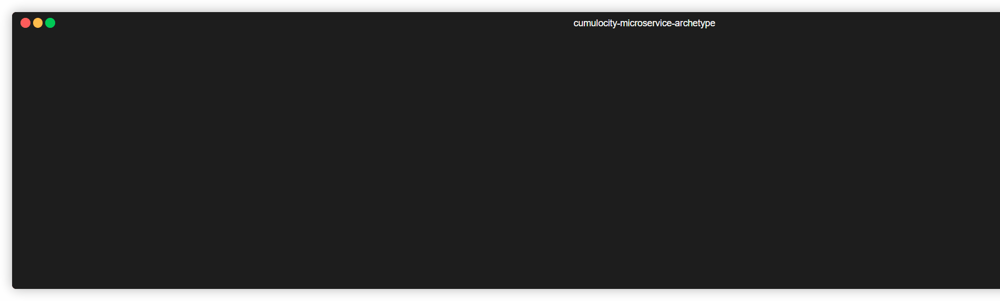
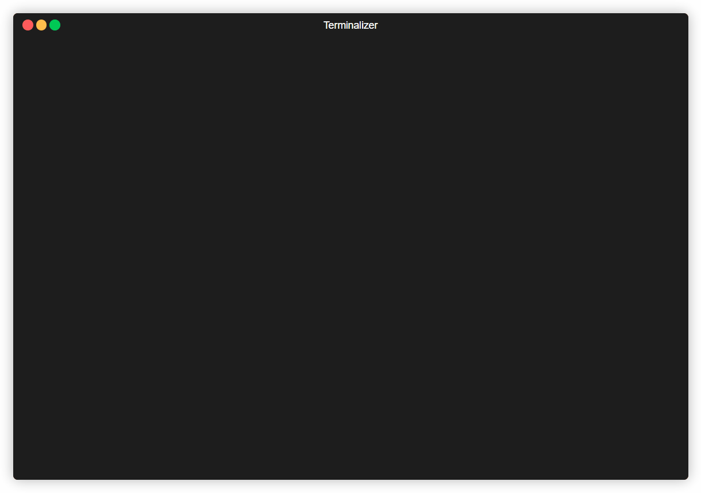

## cumulocity-microservice-archetype

Maven archetype to generate cumulocity microservice project. Based on https://github.com/Cumulocity-IoT/cumulocity-clients-java and https://cumulocity.com/guides/microservice-sdk/java/#java-microservice 

The project will contain following project structure:

```console
project
|-- pom.xml
|-- .gitignore
|-- README.md
|-- initializr.ps1
|-- initializr.sh
|-- .vscode
|    `-- launch.json
|-- .idea
|    `-- runConfigurations
|        `-- Spring_Boot-App.xml
|-- .github
    |-- agents
    |    `-- ps-java-microservice.agent.md
|    `-- workflows
        |-- maven_build.yml
|        `-- maven_build_deploy.yml
`-- src
    |-- main
    |  | -- java
    |  |    `-- package
    |  |         | -- App.java
    |  |         | -- controller/ExampleController.java
    |  |          `-- service/ExampleService.java
    |  | -- resources
    |  |    |-- application.properties
    |  |    |-- application-dev.properties
    |  |    |-- application-test.properties
    |  |    |-- application-prod.properties
    |  |     `-- banner.txt
    |   `-- configuration
    |       |-- cumulocity.json
    |        `-- logging.xml
```

The project contains also two initializr scripts one for windows and one for linux/macOS. This script fetches the cumulocity microservice bootstrap credentials and stores the environment variables for local development in `.env/dev.env`. It also contains example code like a REST controller which must be replaced or removed depending on your further development.

However the generated project is directly runnable and prepared for VSCode and IntelliJ IDEA without any additional changes. It includes also some best practices like:

- using spring profiles (dev, test and prod)
- using specific launch configurations for VSCode and IntelliJ IDEA and externalized cumulocity bootstrap configuration
- using best practices for gitignore and README.md
- using Logback configuration file
- using current java cumulocity microservice SDK + configuration via cumulocity.json
- using custom banner with cumulocity SDK version
- using JUnit 5 and SpringBootTest to check if context load is successful
- using GitHub Actions for CI/CD to build and deploy the microservice to cumulocity tenant
- using Copilot custom agent to support you during development


## Prerequisites

- Java installed >= 17
- Maven installed >= 3.6
- Cumulocity IoT Tenant >= 2025.1.0
- [go-c8y-cli](https://goc8ycli.netlify.app/) installed and configured


## Run

Cloning this repository into you local GIT repository

```console
git clone https://github.com/SoftwareAG/cumulocity-microservice-archetype.git
```

Go to project

```console
cd cumulocity-microservice-archetype
```

Install archetype localy in your local maven repository

```console
mvn install
```

Go to the folder you want to generate the project

```console
cd ..
```

Generate C8y miroservice project using interactive mode

Most Terminals:
```terminal
mvn archetype:generate -DarchetypeGroupId=cumulocity.microservice -DarchetypeArtifactId=cumulocity-microservice-archetype -DinteractiveMode=true
```

Powershell:
```terminal
mvn archetype:generate "-DarchetypeGroupId=cumulocity.microservice" "-DarchetypeArtifactId=cumulocity-microservice-archetype" "-DinteractiveMode=true"
```



### Step 1: Define your microservice name

```console
[INFO] Generating project in Interactive mode
[INFO] Archetype [cumulocity.microservice:cumulocity-microservice-archetype:1.0.0-SNAPSHOT] found in catalog local
Define value for property 'microserviceName':
```

If your microservice name has more than one words, seperate the words by '-'


### Step 2: Define your artifact id (default value cumulocity-microservice-<microservice name>)

```console
[INFO] Generating project in Interactive mode
[INFO] Archetype [cumulocity.microservice:cumulocity-microservice-archetype:1.0.0-SNAPSHOT] found in catalog local
Define value for property 'microserviceName': hello-devices
[INFO] Using property: groupId = cumulocity.microservice
[INFO] Using property: version = 1.0.0-SNAPSHOT
[INFO] Using property: c8yVersion = 2025.81.0
Define value for property 'artifactId' cumulocity-microservice-hello-devices: :
```

You can now just hit enter to continue with default or enter your own artificat id.

### Step 3: Define your package name (default value cumulocity.microservice.<microservice name>)

```console
[INFO] Generating project in Interactive mode
[INFO] Archetype [cumulocity.microservice:cumulocity-microservice-archetype:1.0.0-SNAPSHOT] found in catalog local
Define value for property 'microserviceName': hello-devices
[INFO] Using property: groupId = cumulocity.microservice
[INFO] Using property: version = 1.0.0-SNAPSHOT
[INFO] Using property: c8yVersion = 2025.81.0
Define value for property 'artifactId' cumulocity-microservice-hello-devices: :
Define value for property 'package' cumulocity.microservice.hello-devices: : cumulocity.microservice.hello_devices
```

You can now just hit enter to continue with default or enter your own artificat id. **!!! Beaware that '-' can't be used at java packages. In that case you must replace '-' with '_'. !!!**

### Step 4: Confirm your configuration with 'Y'

```console
[INFO] Generating project in Interactive mode
[INFO] Archetype [cumulocity.microservice:cumulocity-microservice-archetype:1.0.0-SNAPSHOT] found in catalog local
Define value for property 'microserviceName': hello-devices
[INFO] Using property: groupId = cumulocity.microservice
[INFO] Using property: version = 1.0.0-SNAPSHOT
[INFO] Using property: c8yVersion = 2025.81.0
Define value for property 'artifactId' cumulocity-microservice-hello-devices: :
Define value for property 'package' cumulocity.microservice.hello-devices: : cumulocity.microservice.hello_devices
Confirm properties configuration:
microserviceName: hello-devices
groupId: cumulocity.microservice
version: 1.0.0-SNAPSHOT
c8yVersion: 2025.81.0
devC8yBaseURL: null
devC8yUserCredentialsBASE64: null
artifactId: cumulocity-microservice-hello-devices
package: cumulocity.microservice.hello_devices
 Y: : Y
```

Now you have created your microservice project successfully!


### Step 5: Open your fresh generated project

Go to the project folder

```console
cd cumulocity-microservice-hello-devices/
```


### Step 6: Initialize your microservice to your development tenant (create, subscribe and retrieve bootstrap credentials)

Create the microservice on your tenant and retrieve the bootstrap credentials by running the initializr script. The script uses the go-c8y-cli, so make sure you have it installed and configured session to your development tenant. The script stores the environment variables in `.env/dev.env` for local development.

If you use Windows run:

```terminal
.\initializer.ps1
```

on Linux or Mac run:

```shell
. ./initializer.sh
```



_IMPORTANT!!!_

The initializer script is optional. You can also manually create the microservice on your tenant and insert the credentials in your environment variables. However the script makes it much more comfortable.

### Step 7: Run the microservice

After initializing your project you should see the run configurations in your IDE. 

In **VSCode** you can find the run configuration in `.vscode/launch.json`. You can start the microservice by pressing `F5` or selecting `Run and Debug` from the sidebar and clicking on `Start Debugging`.

For **IntelliJ** IDEA you can find the run configuration in `.idea/runConfigurations/Spring_Boot-App.xml`. You can start the microservice by opening the `Run` menu and selecting `Run 'Spring_Boot-App'`.

After starting the microservice you should see in the console output something like:

```console
2024-06-12 10:15:30.123  INFO 12345 --- [           main] c.c.microservice.hello_devices.App         : Started App in 3.456 seconds (JVM running for 4.567)
```

Open the browser and open link http://localhost:8080/api/hello/devices, you have to insert your Cumulocity credentials, keep in mind to set the tenant Id in front of your user name like t2134/alexander.pester@cumulocity.com.

Now your microservice is ready to evolve!!!

For building docker container please change property in pom file to:

```console
<c8y.docker.skip>false</c8y.docker.skip>
```

The maven build will create a docker image!

## Authors 

[Alexander Pester](mailto:alexander.pester@cumulocity.com)

# Useful links 

📘 Explore the Knowledge Base   
Dive into a wealth of Cumulocity IoT tutorials and articles in our [Tech Community](https://techcommunity.cumulocity.com).  

💡 Get Expert Answers    
Stuck or just curious? Ask the Cumulocity IoT experts directly on our [Forum](https://techcommunity.cumulocity.com/c/forum/5).   

🚀 Try Cumulocity IoT    
See Cumulocity IoT in action with a [Free Trial](https://www.cumulocity.com/start-your-journey/free-trial).   

✍️ Share Your Feedback    
Your input drives our innovation. If you find a bug, please create an issue in the repository. If you'd like to share your ideas or feedback, please post them [here](https://techcommunity.cumulocity.com/c/feedback-ideas/14). 
